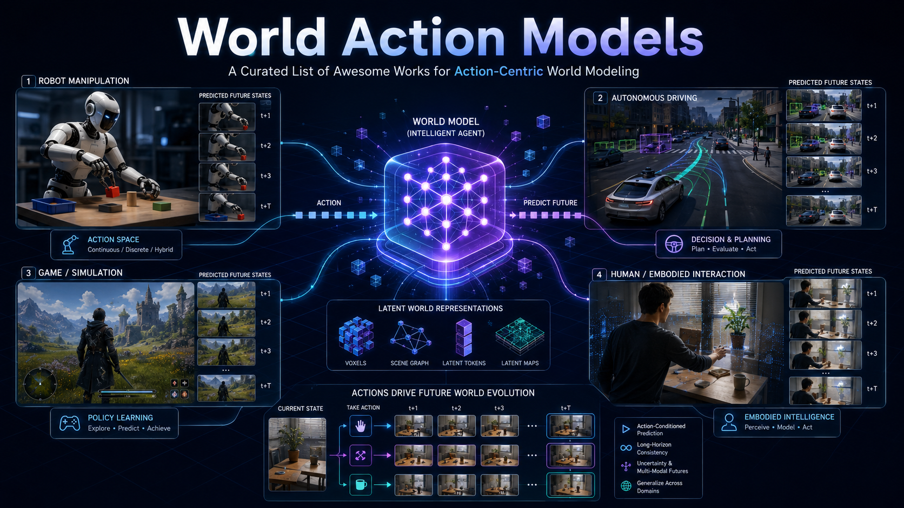

<div align="center">

# 🌍 Awesome World Action Models

[](https://awesome.re)
[](#contributing)
[](https://arxiv.org/)
[](#what-is-a-world-action-model)

**A curated list of papers on World Action Models, action-centric world modeling, and adjacent video-action models for embodied intelligence.**

<p align="center">
  
</p>

</div>

---

## 🚩 News & Updates

- **[2026-06-04] Repository reorganization**: Papers are now grouped by survey, robotics / embodied AI, autonomous driving, navigation, VLA-related work, and general WAM methods.
- **[Ongoing] Contributions welcome**: Pull requests for new WAM papers, project pages, code links, and category fixes are welcome.

---

## 🧭 Overview

- [What is a World Action Model?](#what-is-a-world-action-model)
- [Reading Roadmap](#reading-roadmap)
- [Survey / Position](#survey--position)
- [Robotics / Embodied AI](#robotics--embodied-ai)
- [Autonomous Driving](#autonomous-driving)
- [Game / Interactive Simulation](#game--interactive-simulation)
- [Navigation](#navigation)
- [VLA / Vision-Language-Action Related](#vla--vision-language-action-related)
- [General WAM Methods / Infrastructure](#general-wam-methods--infrastructure)
- [Contributing](#contributing)
- [Acknowledgements](#acknowledgements)
- [Citation](#citation)

---

## 🎯 What is a World Action Model?

World Action Models (WAMs) are action-centric world models that connect **what an agent does** with **how the world changes**. Compared with passive video generation or generic world modeling, WAMs usually emphasize action-conditioned prediction, controllable imagination, policy learning, planning, and embodied interaction.

This list focuses on papers that explicitly study WAMs or closely adjacent ideas such as video-action generation, action-conditioned world simulation, VLA comparison, and robotics / autonomous-driving applications.

---

## 🗺️ Reading Roadmap

1. **Start with the position paper**: read *World Action Models: The Next Frontier in Embodied AI* to understand the motivation and scope.
2. **Learn the core methods**: move to GeoSem-WAM, X-WAM, NoiseGate, Fast-WAM, and related method papers.
3. **Pick an application track**: robotics / embodied AI, autonomous driving, or navigation.
4. **Compare with VLAs**: read the WAM vs VLA diagnostics and robustness papers to understand where WAMs differ from policy-only models.
5. **Look at adjacent video-action models**: use Donk, VAG, Action Images, and Self-Correcting VLA as bridges to data generation and policy refinement.

---

## 📖 Survey / Position

- **World Action Models: The Next Frontier in Embodied AI**. [](https://arxiv.org/abs/2605.12090)

---

## 🤖 Robotics / Embodied AI

- **OSCAR**, "Omni-Embodiment Skeleton-Conditioned World Action Model for Robotics". [](https://arxiv.org/abs/2606.04463) [](https://wuzy2115.github.io/oscar-project-page/)
- **Cosmos 3**, "Omnimodal World Models for Physical AI". [](https://arxiv.org/abs/2606.02800) [](https://research.nvidia.com/labs/cosmos-lab/cosmos3)
- **SANTS**, "A State-Adaptive Scheduler for World Action Models". [](https://arxiv.org/abs/2605.27947) [](https://advanced-robotics-lab.github.io/SANTS/)
- **HarmoWAM**, "Harmonizing Generalizable and Precise Manipulation via Adaptive WAM". [](https://arxiv.org/abs/2605.10942)
- **OA-WAM**, "Object-Addressable World Action Model for Robust Robot Manipulation". [](https://arxiv.org/abs/2605.06481)
- **Being-H0.7**, "A Latent World-Action Model from Egocentric Videos". [](https://arxiv.org/abs/2605.00078)
- **MotuBrain**, "An Advanced World Action Model for Robot Control". [](https://arxiv.org/abs/2604.27792)
- **JailWAM**, "Jailbreaking World Action Models in Robot Control". [](https://arxiv.org/abs/2604.05498)
- **VTAM**, "Video-Tactile-Action Models for Complex Physical Interaction Beyond VLAs". [](https://arxiv.org/abs/2603.23481) [](https://plan-lab.github.io/projects/vtam/)
- **World Action Models are Zero-shot Policies**. [](https://arxiv.org/abs/2602.15922) [](https://dreamzero0.github.io/)
- **DyWA**, "Dynamics-adaptive World Action Model for Generalizable Non-prehensile Manipulation". [](https://arxiv.org/abs/2503.16806) [](https://pku-epic.github.io/DyWA/)
- **Donk**, "Unified Video-Action Joint Denoising for Dexterous Action and Data Generation". [](https://arxiv.org/abs/2606.03868)
- **OASIS**, "Observation-Action Space Alignment via SE(3) Trajectory Prediction for Robotic Manipulation". [](https://arxiv.org/abs/2605.25829)
- **DexWorldModel**, "Causal Latent World Modeling towards Automated Learning of Embodied Tasks". [](https://arxiv.org/abs/2604.16484)
- **VAG**, "Dual-Stream Video-Action Generation for Embodied Data Synthesis". [](https://arxiv.org/abs/2604.09330)
- **Action Images**, "End-to-End Policy Learning via Multiview Video Generation". [](https://arxiv.org/abs/2604.06168) [](https://actionimages.github.io/)
- **Self-Correcting VLA**, "Online Action Refinement via Sparse World Imagination". [](https://arxiv.org/abs/2602.21633)

---

## 🚗 Autonomous Driving

- **NVIDIA OmniDreams**, "Real-Time Generative World Model for Closed-Loop AV Simulation". [](https://arxiv.org/abs/2606.03159)
- **DriveWAM**, "Video Generative Priors Enable Scalable World-Action Modeling for Autonomous Driving". [](https://arxiv.org/abs/2605.28544)
- **DriveDreamer-Policy**, "A Geometry-Grounded World-Action Model for Unified Generation and Planning". [](https://arxiv.org/abs/2604.01765) [](https://drivedreamer-policy.github.io/)
- **Latent-WAM**, "Latent World Action Modeling for End-to-End Autonomous Driving". [](https://arxiv.org/abs/2603.24581)

---

## 🎮 Game / Interactive Simulation

No clearly related WAM papers yet. This section is kept for future action-conditioned interactive world simulators in games or playable environments.

---

## 🧭 Navigation

- **WAM-Nav**, "Asymmetric Latent World-Action Modeling for Unified Visual Navigation". [](https://arxiv.org/abs/2606.04907)
- **ImagineUAV**, "Aerial Vision-Language Navigation via World-Action Modeling". [](https://arxiv.org/abs/2606.01205)
- **WorldVLN**, "Autoregressive World Action Model for Aerial Vision-Language Navigation". [](https://arxiv.org/abs/2605.15964)

---

## 👁️ VLA / Vision-Language-Action Related

- **Beyond Task Success**, "Behavioral and Representational Diagnostics for WAM and VLA". [](https://arxiv.org/abs/2606.01095)
- **VTAM**, "Video-Tactile-Action Models for Complex Physical Interaction Beyond VLAs". [](https://arxiv.org/abs/2603.23481) [](https://plan-lab.github.io/projects/vtam/)
- **Do World Action Models Generalize Better than VLAs? A Robustness Study**. [](https://arxiv.org/abs/2603.22078)
- **Self-Correcting VLA**, "Online Action Refinement via Sparse World Imagination". [](https://arxiv.org/abs/2602.21633)
- **ImagineUAV**, "Aerial Vision-Language Navigation via World-Action Modeling". [](https://arxiv.org/abs/2606.01205)
- **WorldVLN**, "Autoregressive World Action Model for Aerial Vision-Language Navigation". [](https://arxiv.org/abs/2605.15964)

---

## 🛠️ General WAM Methods / Infrastructure

- **GeoSem-WAM**, "Geometry- and Semantic-Aware World Action Models". [](https://arxiv.org/abs/2606.03188)
- **WALL-WM**, "Carving World Action Modeling at the Event Joints". [](https://arxiv.org/abs/2606.01955)
- **Point Tracking Improves World Action Models**. [](https://arxiv.org/abs/2605.23856)
- **The DAWN of World-Action Interactive Models**. [](https://arxiv.org/abs/2605.11550)
- **NoiseGate**, "Learning Per-Latent Timestep Schedules as Information Gating in WAM". [](https://arxiv.org/abs/2605.07794)
- **Is the Future Compatible?**, "Diagnosing Dynamic Consistency in World Action Models". [](https://arxiv.org/abs/2605.07514)
- **CKT-WAM**, "Parameter-Efficient Context Knowledge Transfer Between WAMs". [](https://arxiv.org/abs/2605.06247)
- **When to Trust Imagination**, "Adaptive Action Execution for WAM". [](https://arxiv.org/abs/2605.06222)
- **EA-WM**, "Event-Aware Generative World Model with Structured Kinematic-to-Visual Action Fields". [](https://arxiv.org/abs/2605.06192)
- **X-WAM**, "Unified 4D World Action Modeling from Video Priors with Asynchronous Denoising". [](https://arxiv.org/abs/2604.26694) [](https://sharinka0715.github.io/X-WAM/)
- **Privileged Foresight Distillation**, "Zero-Cost Future Correction for WAM". [](https://arxiv.org/abs/2604.25859)
- **AIM**, "Intent-Aware Unified World Action Modeling with Spatial Value Maps". [](https://arxiv.org/abs/2604.11135)
- **Enhancing Policy Learning with World-Action Model**. [](https://arxiv.org/abs/2603.28955)
- **GigaWorld-Policy**, "An Efficient Action-Centered World-Action Model". [](https://arxiv.org/abs/2603.17240)
- **Fast-WAM**, "Do World Action Models Need Test-time Future Imagination?". [](https://arxiv.org/abs/2603.16666)
- **JOWA**, "Scaling Offline Model-Based RL via Jointly-Optimized World-Action Model Pretraining". [](https://arxiv.org/abs/2410.00564)
- **Learning Visual Feature-Based World Models via Residual Latent Action**. [](https://arxiv.org/abs/2605.07079)

---

## 🤝 Contributing

Please open a pull request if you want to add a paper, project page, code link, or category correction.

Recommended entry format:

```markdown
- **Short Name**, "Full Paper Title". [](ARXIV_URL) [](PROJECT_URL)
```

Useful metadata for new papers:

- Title
- arXiv / paper link
- Project page or code link, if available
- Suggested category
- Whether it is a core WAM paper or an adjacent video-action / world-model paper

---

## 🙏 Acknowledgements

This repository is inspired by broader awesome lists on world models and embodied world models. Thanks to the authors and maintainers of related resources for mapping the larger world-model landscape.

---

## 📝 Citation

If you find this repository useful, please consider citing it:

```bibtex
@misc{awesome_world_action_models,
  title = {Awesome World Action Models},
  author = {Haoyu Zhao and {Awesome World Action Models Contributors}},
  howpublished = {\url{https://github.com/gulucaptain/Awesome-Wold-Action-Models}},
  year = {2026}
}
```
